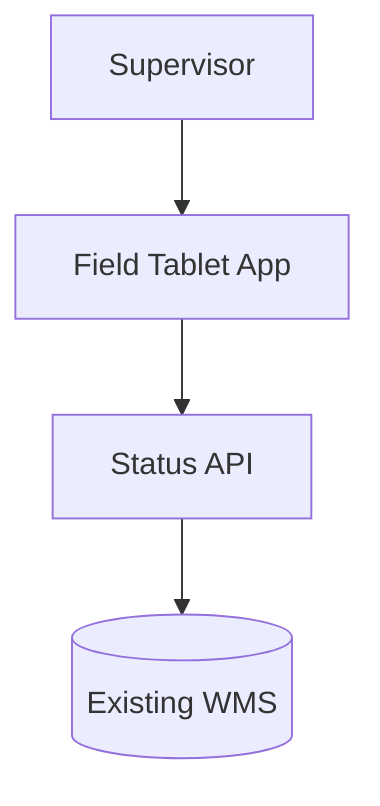

# Architecture document structure

Write the architecture as a single Markdown document. The goal is an architecture
a reader can trust *because* every choice is tied back to a requirement and its
evidence — the same evidence-first discipline SpecLive applies to requirements.
Mirror this repo's own docs style (`docs/architecture/README.md` for C4 + Mermaid,
`docs/adr/*.md` for decisions).

Use this template. Keep every section; write `_None._` rather than dropping one.

```markdown
# Architecture — <Workspace name>

- **Source:** SpecLive workspace `<id>` (<N> conversation(s)), pulled <date>
- **Baseline scope:** which requirement states this design commits to
  (firm = customer_confirmed / baselined) and how tentative items were treated.

## 1. Summary
2–4 sentences: what is being built, the shape of the solution, and the single
biggest constraint or risk driving the design.

## 2. Requirements this design commits to (firm)
A short table of the FIRM items the architecture satisfies. This is the contract.

| ID | Requirement | How the architecture meets it |
|----|-------------|-------------------------------|
| OBJ-001 | Improve warehouse flow… | §4 event pipeline + §5 status service |

## 3. Assumptions & things still to confirm (tentative)
Every TENTATIVE item the design leans on, stated as an assumption with the
requirement ID and what happens if it turns out false. Never present these as
settled — they are unconfirmed inferences.

| ID | Assumed | Confidence | If wrong… |
|----|---------|-----------|-----------|
| REQ-012 | Must work offline and sync | 62% | Drops the local store in §4; revisit before build |

## 4. Context & containers (C4 levels 1–2)
A **complete, rendered Mermaid diagram** — not a placeholder, not a
description of what the diagram would show — of the system in its
environment (level 1: actors, the system, the external systems it talks to)
and its major deployable units (level 2: containers). Follow it with a
sentence per container on its responsibility. Constraints (existing WMS,
target hardware, deadlines) belong here.


(The block above is illustrative shape only — write the actual nodes and
edges for this design, with real container names, not this example.)

## 5. Components & key flows
The important internal components, as a **complete Mermaid diagram** (a
second flowchart, or a sequence diagram for a request/response flow), plus
one or two sequence/flow diagrams for the requirements that drive the design
(e.g. the "status within 30s" path). Tie each flow to the requirement ID it
serves.

## 6. Design decisions (ADR-style)
For each significant choice, one short block. Trace it to the requirement(s) and
name what it trades away — matches `docs/adr` (Context / Decision / Consequences).

### D1 — <decision title>
- **Drivers:** REQ-002, CON-004
- **Decision:** …
- **Consequences / trade-offs:** …
- **Alternatives considered:** …

## 7. Requirements coverage
A checklist so a reader can confirm nothing firm was dropped and see where each
tentative item landed.

| ID | State | Addressed in | Notes |
|----|-------|--------------|-------|

## 8. Open questions & risks
The workspace's `open_questions` and `risks`, each turned into either a design
risk (with mitigation) or a decision deferred to a spike. These block baselining
the architecture, so make them visible.
```

## Rules that make the output trustworthy

- **Write every diagram out in full, inline, as Mermaid code.** §4 and §5 each
  need actual ` ```mermaid ` code blocks with real nodes, edges, and labels
  for this design — never a sentence like "see the container diagram below"
  with nothing under it, never a diagram described in prose instead of drawn,
  and never a diagram left in a separately-published artifact only. The
  point is that opening the `.md` file and rendering it (GitHub, Claude,
  most editors) shows the diagram with no extra step.
- **Cite requirement IDs inline.** Any load-bearing sentence in the design should
  name the ID(s) it serves (e.g. "a change-data-capture stream feeds a status
  cache (REQ-002)"). A design a reader can't trace back to requirements is exactly
  what SpecLive exists to prevent.
- **Firm vs tentative is the spine.** The confirmed items are the contract; the
  tentative ones are assumptions. If the firm set is thin (or, as often happens,
  the functional requirements are still candidates), say so plainly and build on
  confirmed objectives + constraints rather than pretending the candidates are
  settled.
- **Constraints are binding.** Items like "retain the existing WMS" or a Q3
  deadline shape the architecture more than features do — honor them in §4 and
  reference them in the decisions they constrain.
- **Success metrics become fitness targets.** Turn each `success_metric` into a
  measurable non-functional target the architecture is designed to hit.
- **Don't invent requirements.** If the design needs something the workspace never
  captured, record it in §3 or §8 as a new assumption/question — don't quietly
  fold it in as if the customer asked for it.
