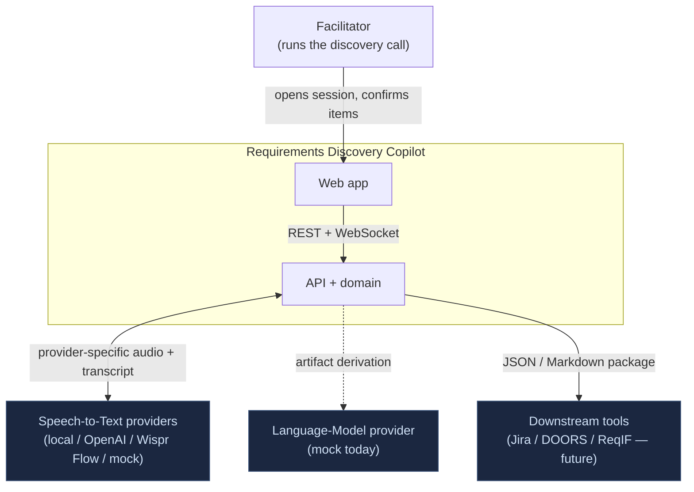
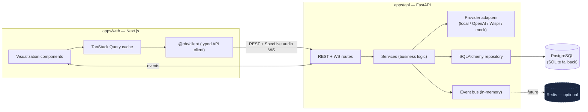
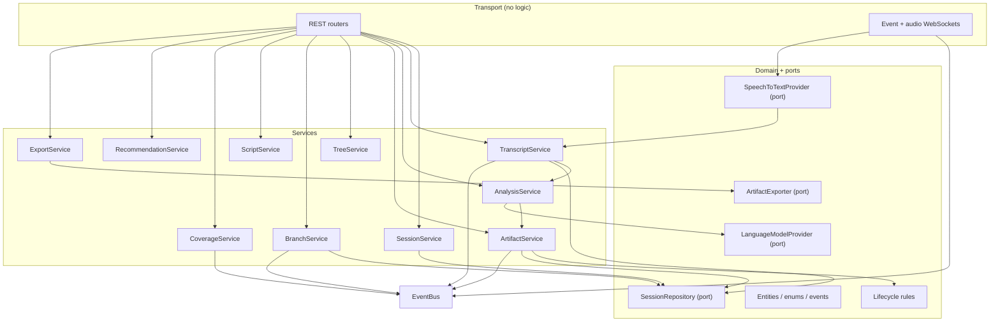
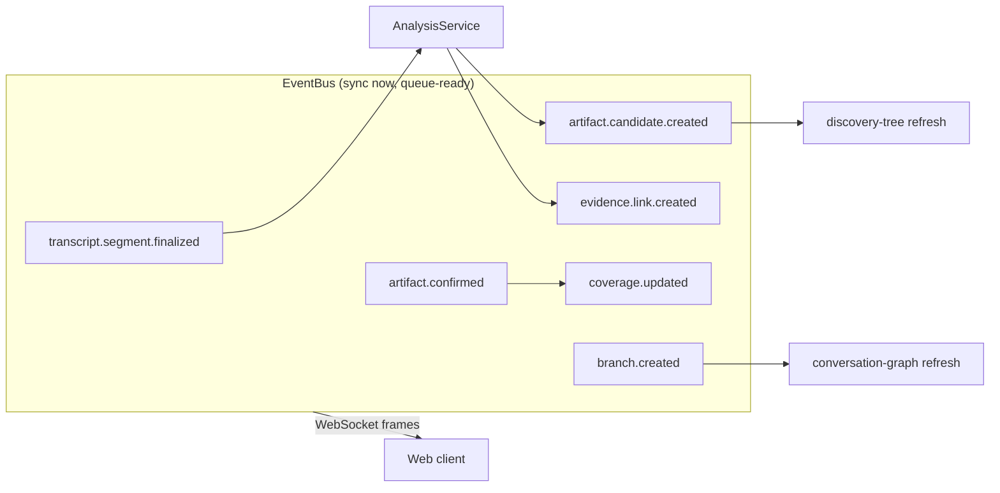
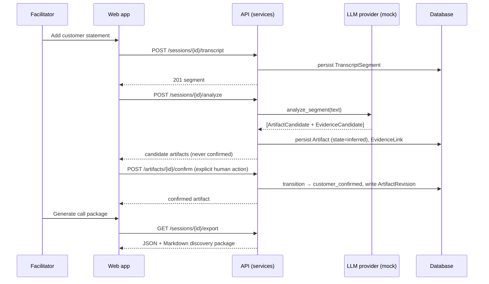
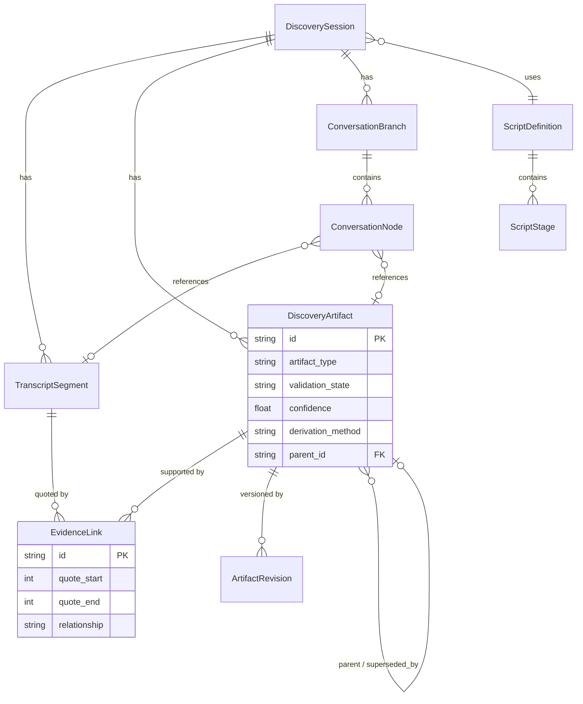

# Architecture

Requirements Discovery Copilot is a monorepo with a clear front-end / back-end
split. The back end owns the domain, persistence, an internal event bus, and the
provider abstractions; the front end renders the six visualizations over typed
server state. This document uses the C4 model (context → container → component)
plus event-flow, derivation-sequence, and data-model diagrams.

## 1. System context

The customer is present in the room but does not use the software directly — the
facilitator is the only user. The browser sends microphone PCM only to SpecLive.
The API selects local faster-whisper, OpenAI Realtime, Wispr Flow, or mock STT;
provider credentials and protocols never enter the frontend. LLM analysis is
still mocked, and the default configuration has no external dependency.

## 2. Container diagram

## 3. Component diagram (API services)

`AnalysisService` calls `ArtifactService` with `actor_is_human=False`, which the
lifecycle rules use to forbid any automated confirmation.

## 4. Event flow

All events implement `DomainEvent.to_wire()`; the same frames feed the WebSocket
today and could feed a Redis/queue consumer later without code changes in the
services.

## 5. Transcript → requirement derivation sequence

## 6. Data model

See the [ADR index](../adr/README.md) for the decisions behind these
structures.
