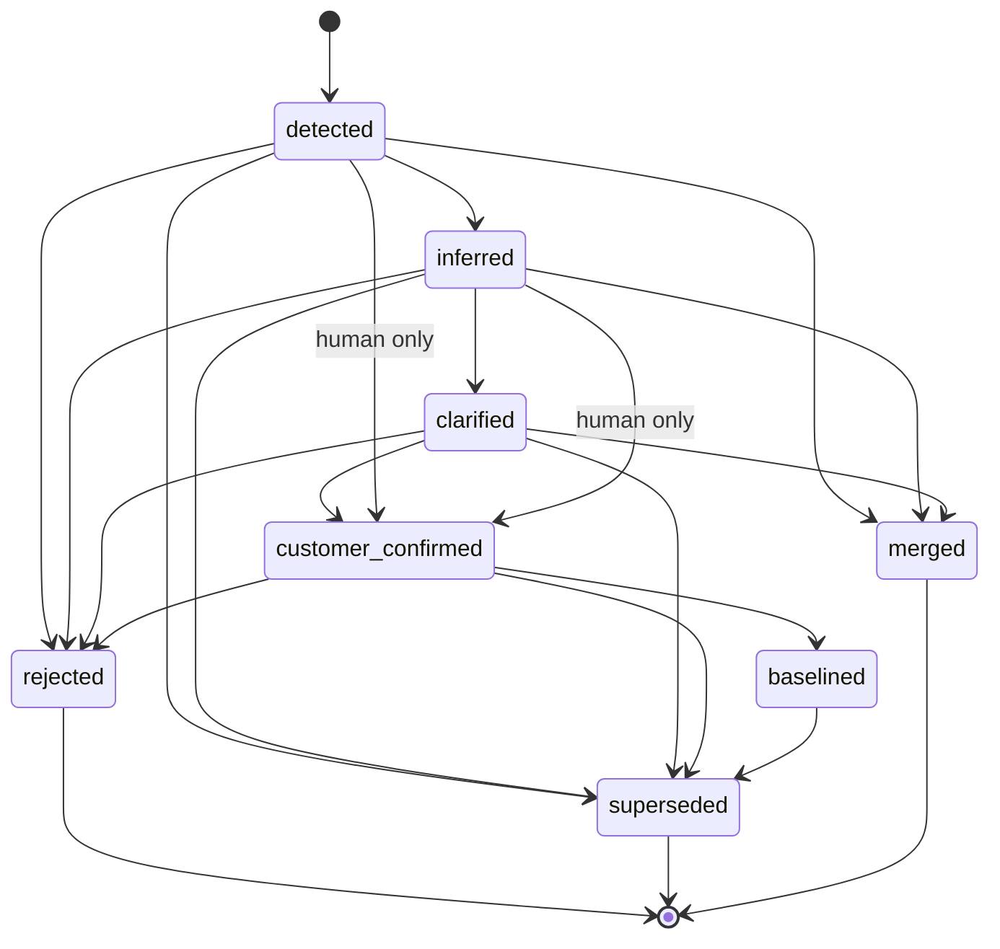

# Artifact Lifecycle

Every discovery artifact moves through a lifecycle that separates what the model
proposed from what the customer confirmed. The rules are enforced in
`app.domain.lifecycle` (see ADR-0007).



## States

| State | Meaning | Reachable by automation? |
|-------|---------|--------------------------|
| `detected` | A candidate was spotted in the transcript | Yes |
| `inferred` | Interpreted into a structured artifact | Yes |
| `clarified` | A follow-up refined it, still unconfirmed | Human |
| `customer_confirmed` | The customer explicitly agreed | **Human only** |
| `baselined` | Locked into the requirement baseline | **Human only** |
| `rejected` | Dismissed | Human |
| `superseded` | Replaced by another artifact | Human |
| `merged` | Folded into another artifact (evidence re-pointed) | Human |

## Derivation chain

The data model and UI keep these distinct at every step:

```
Customer source statement (TranscriptSegment)
  → Interpreted need        (artifact_type=stakeholder_need, inferred)
  → Candidate requirement   (artifact_type=requirement, inferred/clarified)
  → Clarification question  (artifact_type=open_question)
  → Confirmed requirement   (customer_confirmed via explicit action)
```

Each candidate retains: source evidence, interpretation rationale, confidence,
derivation method, current validation state, and revision history.

## Status rollup

The UI shows a coarser `status` derived from the state:
`candidate` (detected/inferred/clarified), `confirmed` (customer_confirmed),
`baselined`, `rejected`, `superseded` (superseded/merged).
