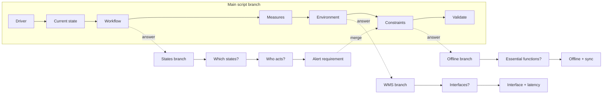

# Discovery Script Model & Conversation Branching Model

## Discovery script model

A **ScriptDefinition** is a versioned, ordered set of **ScriptStages**. Each
stage has an objective, a primary prompt, alternative prompts, and completion
criteria. The script is the conversation's anchor: it defines the intended
sequence and gives the facilitator the next best question.

```
ScriptDefinition (name, version)
└── ScriptStage (sequence, title, objective, primary_prompt, alternatives, criteria)
```

Per-session progress (which stage is current) is tracked in the session's
`metadata.script_stage_index`, advanced via
`POST /sessions/{id}/script/advance`, which emits `script.stage.completed`.

The seeded **Operational Systems Discovery** script has seven stages: Business
driver → Current state → Workflow decisions → Success measures → Technical
environment → Constraints and risks → Validate and close.

## Conversation branching model

The scripted conversation is the **main branch**. A customer answer can spawn a
**side branch** — a focused thread of follow-up questions, findings,
requirements, risks, and decisions — that keeps its own evidence and derived
artifacts, then may **merge back** into a later script stage.



### Entities

- **ConversationBranch** — `source_stage_id`, `created_from_segment_id`,
  `merge_target_stage_id`, `status` (open/active/queued/merged/abandoned).
- **ConversationNode** — a point on a branch (`script_stage`, `question`,
  `answer`, `finding`, `requirement`, `risk`, `decision`, `merge`), optionally
  referencing a transcript segment and/or an artifact.

### Projections

The same branch/node data drives three views (ADR-0008):

- **Git branch tree** — lanes = branches, columns = time; nodes are commits.
- **Conversation subway** — routes = topics, stations = touch points; transfers
  where branches reconnect.
- **Coverage matrix** — rows = branches, columns = script stages; cells show
  evidence strength.

The main script always remains the visible anchor while every branch's evidence
and derived artifacts stay attached and traceable.
